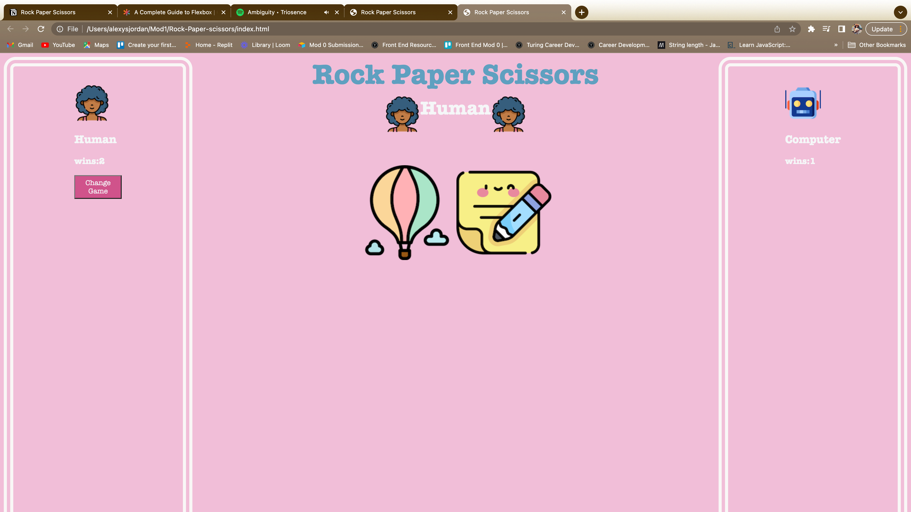

# Rock-Paper-scissors
### Abstract:
[//]: <> (Briefly describe what you built and its features. What problem is the app solving? How does this application solve that problem?)
The application is to play Rock, Paper, Scissors. If someone wants to play the game but has no partner in reality, they can play the game virtually with a computer. If Classic Rock, Paper, Scissors is too easy, there is also a difficult version to turn up the heat for more advanced users.

### Installation Instructions:
[//]: <> (What steps does a person have to take to get your app cloned down and running?)
Open up the terminal and paste the SSH code after typing git clone in the terminal. Next enter the repesitory with the cd command. Then type code . and the code will come up in the text editer. Then in the terminal type open index.html and the application will open in the browser.
https://lexyful.github.io/Rock-Paper-scissors/

### Preview of App:
[//]: <> (Provide ONE gif or screenshot of your application - choose the "coolest" piece of functionality to show off.)

### Context:
[//]: <> (Give some context for the project here. How long did you have to work on it? How far into the Turing program are you?) 
The project took about 30 hours to complete. I'm just at the end of Mod1.
### Contributors:
[//]: <> (Who worked on this application? Link to their GitHubs.)
Lexye https://github.com/Lexyful/ --Lexye

### Learning Goals:
[//]: <> (What were the learning goals of this project? What tech did you work with?)
Now that I am at the end of the mod, the goal is to demonstrate what I've learned up to this point. Specifically showing how to properly set up a data model that can function entirely without relying on the DOM. I was also aiming to show how to use event delegation to set up my event listeners. Hopefully all of that was shown alongside DRY javascript and displayed logic to play the two games.

### Wins + Challenges:
[//]: <> (What are 2-3 wins you have from this project? What were some challenges you faced - and how did you get over them?)
- I really had to rely on the knowledge I have to see this project through to the end. A major nontechnical challenge was overcoming the negative voice in my head. It can be very loud especially when first starting out on the project, but I was able to zone in on the task at hand and practice positive self talk. That was a major win.
- So many concepts that I was fuzzy on throughout the mod came into focus for me during this project. The event delegation was crucial to get this app to work so using it to build the page made it feel more intuitive. 
- I was able to play the game in the console before I played the game in the DOM. I felt very impressed with that.
